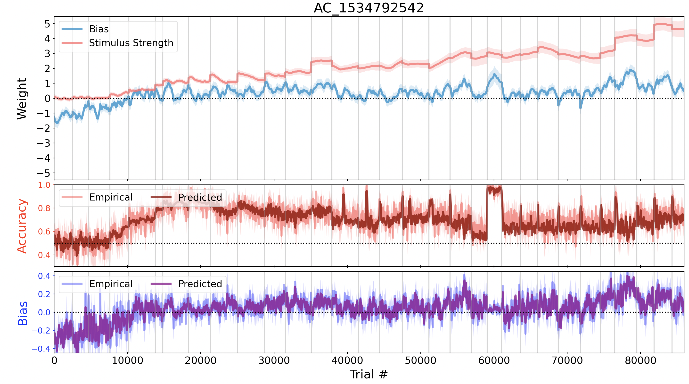

# Born Lab - Time-Varying Behavorial Analysis

This repository contains the methods ... (in progress!)

## Dependencies
- Python 3.10.5
- Numpy 1.20
- Matplotlib 3.3
- Scipy 1.8.0

## Data
One task for one subject is included in this repository (Apollo, Cardinal, no cooling).  The subject's data is alreadypre-processed and ready to run. This repository is compatiable with two subjects (Apollo, Urkel), three tasks paradigms, (Cardinal, Oblique, Interleaved), and with cooling/non-cooling data.  The data was collected as a part of a series of experiments done at Harvard Medical School with the Born Lab (experiments not done by me).

## Run

From the root folder, run
```
python run.py -s [SUBJECT] -t [TASK] [OPTIONS]
```
For example, the following will run Apollo's non-cooling Cardinal task from 2017, with standardization and plotting: 
```
python run.py -s A -t C --standardize --plot
```
A wide selection of configurations are available for specification: 
```
usage: run.py [-h] -s {A,U} -t {C,O,I,I19,C19} [-c] [-sd SEED] [-dp DATA_PATH] [-sp SAVE_PATH]
              [-w WEIGHTS [WEIGHTS ...]] [-std] [-o OPTLIST [OPTLIST ...]] [-f FOLDS] [-p]

optional arguments:
  -h, --help            show this help message and exit
  -s {A,U}, --subject {A,U}
                        Subject to use for analysis, Apollo (A) or Urkel (U).
  -t {C,O,I,I19,C19}, --task {C,O,I,I19,C19}
                        Task Selection: Cardinal (C), Oblique (O), Interleaved (I), Interleaved 2019 (I19, Apollo Only),
                        Cardinal 2019 (C19, Apollo Only).
  -c, --cooling         Flag indicating whether or not cooling session is desired.
  -sd SEED, --seed SEED
                        Specify a manual seed. Otherwise random.
  -dp DATA_PATH, --data_path DATA_PATH
                        Data path to save to. Default = ../data/.
  -sp SAVE_PATH, --save_path SAVE_PATH
                        Experimental path to save to. Default = ../output/.
  -w WEIGHTS [WEIGHTS ...], --weights WEIGHTS [WEIGHTS ...]
                        List of weights to use. Supported options: [bias, stimulus_strength, reward_history, stim_1,
                        stim_2, avg_stim, StimulusStrength*RewardHistory, stim0, stim45, stim90, stim135]. Default =
                        [bias, stimulus_strength].
  -std, --standardize   Zero-mean and normalize data over entire session if set to true.
  -o OPTLIST [OPTLIST ...], --optList OPTLIST [OPTLIST ...]
                        List of hyperparameters to optimize over. Default = [sigma, sigDay].
  -f FOLDS, --folds FOLDS
                        Number of folds for cross-validation.
  -p, --plot            Flag indicating whether or not plots should be made after training.
```

## Regraph

The `predict.py` script is provided to run a trained model on any given input image.

```
Usage: predict.py [OPTIONS]

Options:
  -d, --dataset [vgg|mbm|dcc|adi]
                                  Dataset to pull image from (HDF5).
                                  [required]

  -i, --index INTEGER             Image index to visualize.
  -c, --checkpoint FILENAME       A path to a checkpoint with weights.
                                  [required]

  -u, --unet_filters INTEGER      Number of filters for U-Net convolutional
                                  layers.

  -co, --convolutions INTEGER     Number of layers in a convolutional block.
  -v, --visualize                 Visualize predicted density map.
  --help                          Show this message and exit.

```

### Examples

```
$ python run.py -s A -t C --standardize --plot                                   
```



